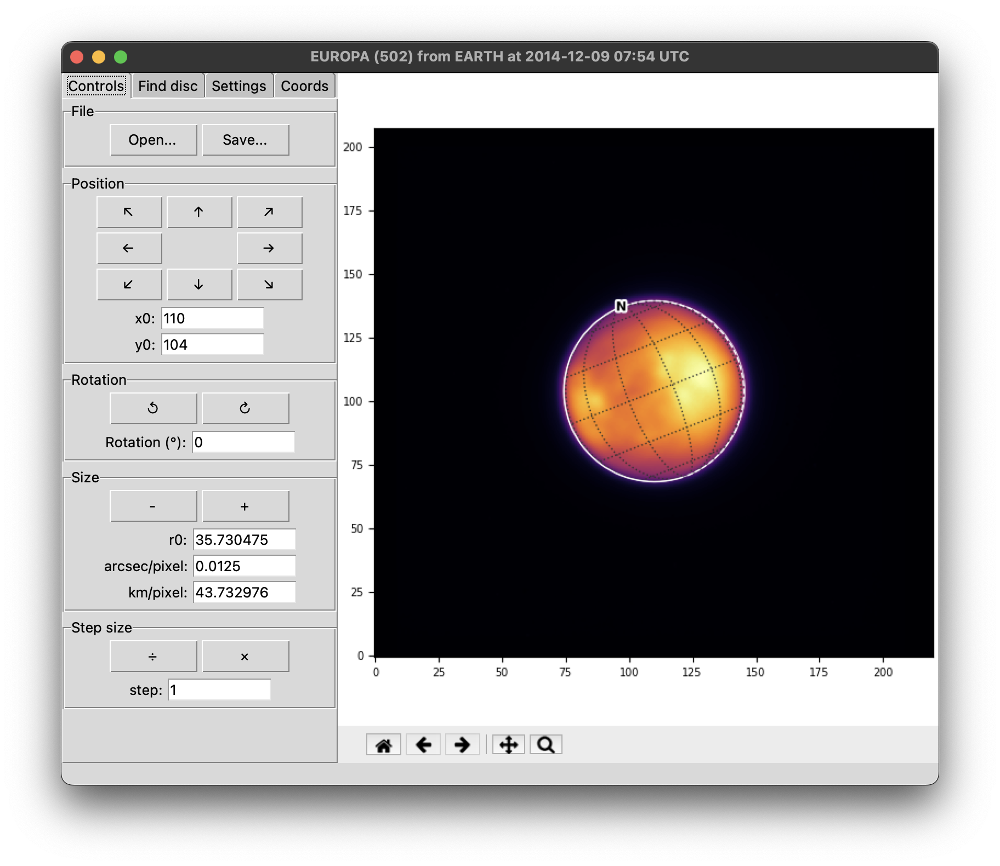

# 

[](https://pypi.org/project/planetmapper/)
[](https://anaconda.org/conda-forge/planetmapper)
[](https://github.com/ortk95/planetmapper/actions/workflows/python-publish.yml)
[](https://github.com/ortk95/planetmapper/actions/workflows/checks.yml)
[](https://planetmapper.readthedocs.io/en/latest/?badge=latest)
[](https://coveralls.io/github/ortk95/planetmapper?branch=main)
[](https://doi.org/10.21105/joss.05728)

PlanetMapper is an open source Python package for visualising, navigating and mapping Solar System observations.

## [Documentation](https://planetmapper.readthedocs.io)
For full documentation and [API reference](https://planetmapper.readthedocs.io/en/latest/documentation.html), visit [planetmapper.readthedocs.io](https://planetmapper.readthedocs.io/en/latest/index.html).


## [Installation](https://planetmapper.readthedocs.io/en/latest/installation.html)
```bash
pip install planetmapper --upgrade
```

```bash
conda install -c conda-forge planetmapper
```

_Requires Python 3.10+_


## Citing PlanetMapper
If you use PlanetMapper in your research, please cite the following paper:

> King et al., (2023). PlanetMapper: A Python package for visualising, navigating and mapping Solar System observations. Journal of Open Source Software, 8(90), 5728, https://doi.org/10.21105/joss.05728

<details>
<summary>Citation BibTeX entry</summary>

```bibtex
@article{king_2023_planetmapper,
  author  = {King, Oliver R. T. and Fletcher, Leigh N.},
  doi     = {10.21105/joss.05728},
  journal = {Journal of Open Source Software},
  month   = oct,
  number  = {90},
  pages   = {5728},
  title   = {{PlanetMapper: A Python package for visualising, navigating and mapping Solar System observations}},
  url     = {https://joss.theoj.org/papers/10.21105/joss.05728},
  volume  = {8},
  year    = {2023}
}
```

</details>

Each PlanetMapper version is also archived on Zenodo at [doi.org/10.5281/zenodo.7963121](https://doi.org/10.5281/zenodo.7963121).


## Key features
### [Fit and map astronomical observations using a full featured user interface](https://planetmapper.readthedocs.io/en/latest/user_interface.html)
[](https://planetmapper.readthedocs.io/en/latest/user_interface.html)

### [Easily visualise solar system observations with just a few lines of code](https://planetmapper.readthedocs.io/en/latest/general_python_api.html#wireframe-plots)

```python
body = planetmapper.Body('saturn', '2020-01-01')
body.plot_wireframe_radec()
plt.show()
```

[](https://planetmapper.readthedocs.io/en/latest/general_python_api.html#wireframe-plots)

### [Convert coordinates, generate backplanes and project maps of telescope observations](https://planetmapper.readthedocs.io/en/latest/general_python_api.html)
[](https://planetmapper.readthedocs.io/en/latest/general_python_api.html)


## Contributing

If you spot a bug, or want contribute code to PlanetMapper, check out the [contributing guidelines](https://github.com/ortk95/planetmapper/blob/main/CONTRIBUTING.md).

## Help and support

If you have any questions, suggestions or feedback, please [visit our support page and get in touch](https://planetmapper.readthedocs.io/en/latest/help.html)!