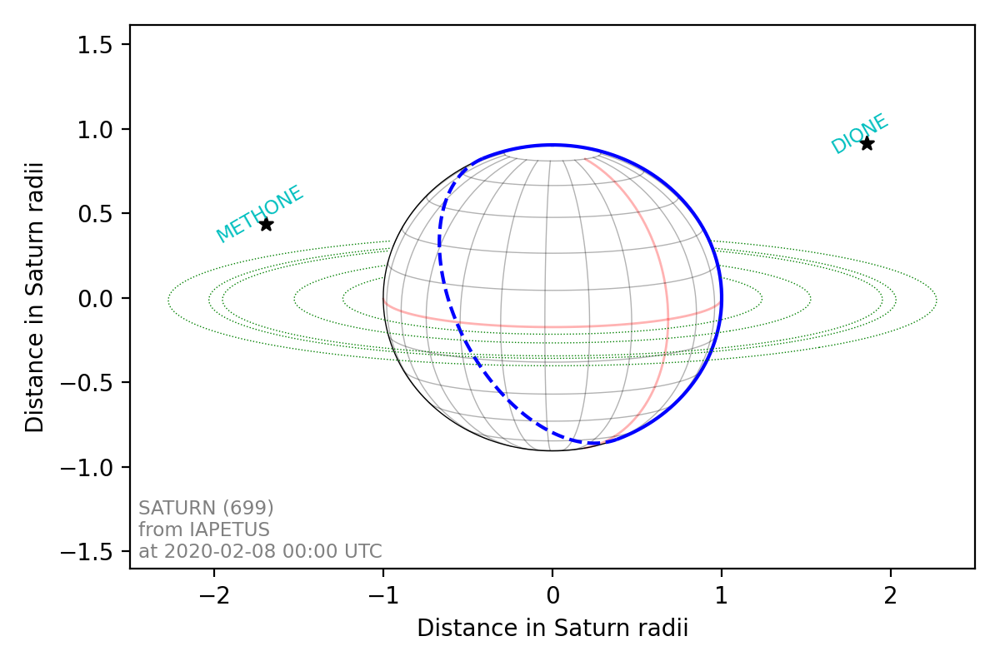

.. _python examples:

Python package
**************
This page shows some simple examples of using the `planetmapper` package in Python code. For more details, see the full :ref:`API documentation <api>`.

For PlanetMapper to function, you will need to download a series of :ref:`SPICE kernels <SPICE kernels>` containing the positions and orientations of the solar system bodies you are interested in. The code snippet below will download all the appropriate kernels needed for the examples on this page. For more details about SPICE kernels, including how to choose, download, and use them, see the :ref:`SPICE kernel documentation page <SPICE kernels>`.

::

    from planetmapper.kernel_downloader import download_urls
    # This command will download ~2GB of data
    # Note, the exact URLs in this example may not work if new kernel versions are published
    download_urls(
        'https://naif.jpl.nasa.gov/pub/naif/generic_kernels/lsk/',
        'https://naif.jpl.nasa.gov/pub/naif/generic_kernels/pck/',
        'https://naif.jpl.nasa.gov/pub/naif/generic_kernels/spk/planets/de430.bsp',
        'https://naif.jpl.nasa.gov/pub/naif/generic_kernels/spk/satellites/jup365.bsp',
        'https://naif.jpl.nasa.gov/pub/naif/generic_kernels/spk/satellites/sat441.bsp',
        'https://naif.jpl.nasa.gov/pub/naif/generic_kernels/spk/satellites/ura111.bsp',
        'https://naif.jpl.nasa.gov/pub/naif/generic_kernels/spk/satellites/nep097.bsp',
        'https://naif.jpl.nasa.gov/pub/naif/HST/kernels/spk/',
    )

Coordinate conversions
======================
Coordinate conversions can easily be performed using functions such as :func:`planetmapper.Body.lonlat2radec` to calculate the sky coordinates corresponding to a planetographic longitude/latitude coordinate on the surface of the target. 

This code shows an example of using some of the functions in :class:`planetmapper.Body` to calculate information about observations of Jupiter from Venus: ::

    import planetmapper

    body = planetmapper.Body('jupiter', '2020-01-01', observer='venus')

    coordinates = [(42, 0), (123, 45)]
    for lon, lat in coordinates:
        print(f'\nlongitude = {lon}°, latitude = {lat}°')
        if body.test_if_lonlat_visible(lon, lat):
            ra, dec = body.lonlat2radec(lon, lat)
            print(f'  RA = {ra:.4f}°, Dec = {dec:.4f}°')
            if body.test_if_lonlat_illuminated(lon, lat):
                phase, incidence, emission = body.illumination_angles_from_lonlat(lon, lat)
                print(f'  phase angle: {phase:.2f}°')     
                print(f'  incidence angle: {phase:.2f}°')     
                print(f'  emission angle: {phase:.2f}°')     
        else:
            print('  (Not visible)')

.. hint::
    The main classes in PlanetMapper are subclasses of each other, with :class:`planetmapper.SpiceBase` the parent class of :class:`planetmapper.Body` which is the parent of :class:`planetmapper.BodyXY` which is the parent of :class:`planetmapper.Observation`. 
    
    In Python, any functions defined in a parent class are available in any subclasses, so for example, you can use :func:`planetmapper.Observation.lonlat2radec` exactly the same way as you can use :func:`planetmapper.Body.lonlat2radec`.

.. _wireframes:

Wireframe plots
===============
'Wireframe' plots showing the geometry of target bodies can be created quickly and easily using the :func:`planetmapper.Body.plot_wireframe_radec` command: ::

    import planetmapper

    body = planetmapper.Body('saturn', '2020-01-01')
    body.plot_wireframe_radec(show=True)

.. image:: images/saturn_wireframe_radec.png
    :width: 600
    :alt: Plot of Saturn

More complex plots can also be created using the functionality in :class:`planetmapper.Body` and manually adding elements to the plot: ::
    
    import planetmapper
    import matplotlib.pyplot as plt

    body = planetmapper.Body('neptune', '2020-01-01')

    # Add Triton to any wireframe plots
    body.add_other_bodies_of_interest('triton') 

    # Mark this specific coordinate (if visible) on any wireframe plots
    body.coordinates_of_interest_lonlat.append((360, -45)) 

    # Add Neptune's rings to the plot
    body.add_named_rings()

    fig, ax = plt.subplots(figsize=(6, 6), dpi=200)
    body.plot_wireframe_radec(ax)

    # Manually add some text to the plot
    ax.text(
        body.target_ra, body.target_dec + 2 / 60 / 60, 'NEPTUNE', color='b', ha='center'
    )

    plt.show()

.. image:: images/neptune_wireframe_radec.png
    :width: 600
    :alt: Plot of Neptune

Wireframe plot variants
-----------------------

A number of different wireframe plotting options are available:

- :func:`planetmapper.Body.plot_wireframe_radec` plots in RA/Dec coordinates
- :func:`planetmapper.Body.plot_wireframe_km` plots in a frame centred showing distances in km from the target body
- :func:`planetmapper.Body.plot_wireframe_angular` plots in a frame showing angular distances from the the target body
- :func:`planetmapper.BodyXY.plot_wireframe_xy` plots in image x and y coordinates

:func:`planetmapper.Body.plot_wireframe_km` is particularly useful for comparing observations taken at different times, as it standardises the position, orientation and size of the target body. The example below shows multiple observations of Jupiter and Io taken over the space of a few hours. Jupiter moves across the the RA/Dec plot (top), but stays fixed in the km plot (bottom), making it easier to see the relative motion of Io: ::

    import planetmapper
    import matplotlib.pyplot as plt
    import numpy as np

    fig, [ax_radec, ax_km] = plt.subplots(nrows=2, figsize=(6, 8), dpi=200)

    dates = ['2020-01-01 00:00', '2020-01-01 01:00', '2020-01-01 02:00']
    colors = ['r', 'g', 'b']

    for date, c in zip(dates, colors):
        body = planetmapper.Body('jupiter', date)
        body.add_other_bodies_of_interest('Io')
        body.plot_wireframe_radec(ax_radec, color=c)
        body.plot_wireframe_km(ax_km, color=c)

        # Plot some blank data with the correct colour to go on the legend
        ax_radec.scatter(np.nan, np.nan, color=c, label=date)

    ax_radec.legend(loc='upper left')

    ax_radec.set_title('Position in the sky')
    ax_km.set_title('Position relative to Jupiter')

    fig.tight_layout()
    plt.show()

.. image:: images/jupiter_wireframes.png
    :width: 600
    :alt: Plot of Jupiter and Io

The example below shows how the the same target appears in the `radec`, `km` and `angular` wireframe variants. By default, :func:`planetmapper.Body.plot_wireframe_angular` is centred on the target body, but it can also be customised to have a custom origin and rotation - for example, the fourth plot below is centred on Miranda and rotated by 45°. In addition to the variants shown here, :func:`planetmapper.BodyXY.plot_wireframe_xy` is also available for use with :class:`planetmapper.BodyXY` objects to plot in image pixel coordinates (see the Observations section below).

::

    import planetmapper
    import matplotlib.pyplot as plt
    
    body = planetmapper.Body('uranus', '2020-01-01')
    body.add_named_rings()
    body.add_other_bodies_of_interest('miranda')

    fig, ((ax_radec, ax_km), (ax_angular1, ax_angular2)) = plt.subplots(
        nrows=2,
        ncols=2,
        figsize=(10, 8),
        dpi=200,
        gridspec_kw=dict(hspace=0.3, wspace=0.3),
    )

    body.plot_wireframe_radec(ax_radec)
    ax_radec.set_title('plot_wireframe_radec()')

    body.plot_wireframe_km(ax_km)
    ax_km.set_title('plot_wireframe_km()')

    body.plot_wireframe_angular(ax_angular1)
    ax_angular1.set_title('plot_wireframe_angular()')

    miranda = body.create_other_body('miranda')
    # angular plot centred on custom RA/Dec and with a custom rotation
    body.plot_wireframe_angular(
        ax_angular2,
        origin_ra=miranda.target_ra,
        origin_dec=miranda.target_dec,
        coordinate_rotation=-45,
    )
    ax_angular2.set_title('plot_wireframe_angular(...)')

    plt.show()

Customising wireframe plots
---------------------------

The appearance and units of wireframe plots can be fully customised to suit your needs. For example, the code below shows how the `scale_factor` argument is used to customise the coordinate units, and the `formatting` argument is used to pass arguments to matplotlib when plotting the individual elements of the wireframe. See :func:`planetmapper.Body.plot_wireframe_radec` for more details on formatting individual plots, and changing the default formatting for all wireframe plots.

::
    
    import planetmapper
    import matplotlib.pyplot as plt

    body = planetmapper.Body('saturn', '2020-02-08', observer='iapetus')
    body.add_other_bodies_of_interest('dione', 'methone')
    body.plot_wireframe_km(
        ax,
        scale_factor=1 / body.r_eq,  # use units of Saturn radii rather than km
        add_title=False,
        label_poles=False,
        indicate_equator=True,
        indicate_prime_meridian=True,
        grid_interval=15,
        grid_lat_limit=75,
        formatting={
            'grid': {'linestyle': '-', 'linewidth': 0.5, 'alpha': 0.3},
            'prime_meridian': {'linewidth': 1, 'color': 'r'},
            'equator': {'linewidth': 1, 'color': 'r'},
            'terminator': {'color': 'b'},
            'limb_illuminated': {'color': 'b'},
            'ring': {'color': 'g', 'linestyle': ':'},
            'other_body_of_interest_marker': {'marker': '*'},
            'other_body_of_interest_label': {'color': 'c', 'rotation': 30, 'alpha': 1},
        },
    )
    ax.set_xlabel('Distance in Saturn radii')
    ax.set_ylabel('Distance in Saturn radii')
    ax.annotate(
        body.get_description(),
        (0.01, 0.02),
        xycoords='axes fraction',
        color='0.5',
        size='small',
    )
    plt.show()

Observations, backplanes and mapping
====================================
.. note::
    You can download an example Europa data file from the `PlanetMapper GitHub repository <https://github.com/ortk95/planetmapper/tree/main/examples/gui_data>`_.

:class:`planetmapper.Observation` objects can be created to calculate information about a specific observation. If the observed data is saved in a FITS file with appropriate header information, a :class:`planetmapper.Observation` object can be created using only the path to that file - target, date and observer information can all be derived automatically from the header. The example below creates an Observation object, and uses it to plot an image containing showing the longitude value of each pixel: ::

    import planetmapper
    import matplotlib.pyplot as plt

    observation = planetmapper.Observation('europa.fits')

    # Set the disc position
    observation.set_plate_scale_arcsec(12.25e-3)
    observation.set_disc_params(x0=110, y0=104)

    observation.plot_backplane_img('LON-GRAPHIC')
    plt.show()

A range of backplane images can be generated - see :ref:`default backplanes` for a list of the backplanes available by default. These backplanes can be saved to a FITS file for future use using :func:`planetmapper.Observation.save_observation`. A mapped version of the image and backplanes can likewise be saved using :func:`planetmapper.Observation.save_mapped_observation`: ::

    import planetmapper

    observation = planetmapper.Observation('europa.fits')

    # Set the disc position
    observation.set_plate_scale_arcsec(12.25e-3)
    observation.set_disc_params(x0=110, y0=104)

    observation.save_observation('europa_navigated.fits')
    observation.save_mapped_observation('europa_mapped.fits')

Mapped data can also be manipulated and plotted directly. In the example below, we use :func:`planetmapper.Observation.get_mapped_data` and :func:`planetmapper.BodyXY.get_backplane_map` to directly access, manipulate and plot the mapped data and backplanes:[#jupiterhst]_ ::
    
    import planetmapper
    import matplotlib.pyplot as plt
    import numpy as np

    # This uses a JPG image, so we need to manually specify details (e.g. target)
    observation = planetmapper.Observation(
        'jupiter.jpg',
        target='jupiter',
        utc='2020-08-25 02:30:40',
        observer='HST',
        show_progress=True, # show progress bars for slower functions
    )

    # Run the GUI to fit the disc interactively
    observation.run_gui()

    fig, axs = plt.subplots(
        nrows=2, ncols=2, figsize=(12, 8), dpi=200, width_ratios=[1, 2]
    )

    # Do a nice RGB plot of the data in the top left
    rgb_img = np.moveaxis(observation.data, 0, 2)  # imshow needs wavelength index last
    axs[0, 0].imshow(rgb_img, origin='lower')
    observation.plot_wireframe_xy(axs[0, 0])

    # Plot the emission angle backplane in the bottom left
    observation.add_other_bodies_of_interest('Europa')  # mark Europa on this plot
    observation.plot_backplane_img('EMISSION', ax=axs[1, 0])

    # Plot the mapped emission angle backplane in the bottom right
    observation.plot_backplane_map('EMISSION', ax=axs[1, 1])

    # Plot a mapped RGB image of the data in the top right
    degree_interval = 0.25  # Plot maps with 4 pixels/degree
    emission_cutoff = 80

    mapped_data = observation.get_mapped_data(degree_interval)  # get the mapped data
    rgb_map = np.moveaxis(mapped_data, 0, 2)  # imshow needs wavelength index last
    rgb_map = planetmapper.utils.normalise(rgb_map)  # normalise to make plot look nicer

    # Only plot areas with emission angles <80deg
    emission_map = observation.get_backplane_map('EMISSION', degree_interval)
    for idx in range(3):
        rgb_map[:, :, idx][np.where(emission_map > emission_cutoff)] = 1
    
    # Display mapped image and add a useful annotation
    observation.imshow_map(rgb_map, ax=axs[0, 1])
    axs[0, 1].annotate(
        f'Showing emission angles < {emission_cutoff}°',
        (0.005, 0.99),
        xycoords='axes fraction',
        size='small',
        va='top',
    )

    # Add some general formatting
    for ax in axs.ravel():
        ax.set_title('')
    fig.suptitle(observation.get_description(multiline=False))
    fig.tight_layout()

    plt.show()

.. image:: images/jupiter_mapped.png
    :width: 800
    :alt: Plot of a mapped Jupiter observation

.. [#jupiterhst] The `Jupiter image <https://hubblesite.org/contents/media/images/2020/42/4739-Image>`_ is from the OPAL program using the Hubble Space Telescope. Credit: *NASA, ESA, STScI, A. Simon (Goddard Space Flight Center), and M.H. Wong (University of California, Berkeley) and the OPAL team*

Backplanes can also be generated for observations which do not exist using :class:`planetmapper.BodyXY`: ::
    
    import planetmapper
    import matplotlib.pyplot as plt
    import numpy as np

    # Create an object representing how Jupiter would appear in a 50x50 pixel image
    # taken from Earth at a specific time
    body = planetmapper.BodyXY('jupiter', utc='2030-01-01', observer='Earth', sz=50)
    body.set_disc_params(x0=25, y0=25, r0=20)

    fig, ax = plt.subplots(figsize=(6, 5), dpi=200)
    body.plot_backplane_img('RADIAL-VELOCITY', ax=ax)
    fig.tight_layout()
    plt.show()

    # Backplane images can also be accessed and manipulated directly
    radial_velocities = body.get_backplane_img('RADIAL-VELOCITY')
    print(f'Average radial velocity: {np.nanmean(radial_velocities):.2f} km/s')

    # Average radial velocity: -21.78 km/s
    
.. image:: images/jupiter_backplane.png
    :width: 600
    :alt: Plot of Jupiter's rotation

Cache behaviour
===============
The generation of backplanes and projected mapped data can be slow for larger datasets. Therefore, :class:`planetmapper.BodyXY` and :class:`planetmapper.Observation` objects automatically cache the results of various expensive function calls so that they do not have to be recalculated. This cache management happens automatically behind the scenes, so you should never have to worry about dealing with it directly. For example, when any disc parameters are changed, the cache is automatically cleared as the cached results will no longer be valid.

::

    import planetmapper

    # Create a new object
    body = planetmapper.BodyXY('Jupiter', '2000-01-01', sz=500)
    body.set_disc_params(x0=250, y0=250, r0=200)
    # At this point, the cache is completely empty

    # The intermediate results used in generating the incidence angle backplane
    # are cached, speeding up any future calculations which use these
    # intermediate results:
    body.get_backplane_img('INCIDENCE') # Takes ~10s to execute
    body.get_backplane_img('INCIDENCE') # Executes instantly
    body.get_backplane_img('EMISSION') # Executes instantly

    # When any of the disc parameters are changed, the xy <-> radec conversion
    # changes so the cache is automatically cleared (as the cached intermediate
    # results are no longer valid):
    body.set_r0(190) # This automatically clears the cache
    body.get_backplane_img('EMISSION') # Takes ~10s to execute
    body.get_backplane_img('INCIDENCE') # Executes instantly

The methods which cache their results include...

- :func:`planetmapper.BodyXY.get_backplane_img`
- :func:`planetmapper.BodyXY.get_backplane_map`
- :func:`planetmapper.Observation.get_mapped_data`
- :func:`planetmapper.Observation.save_observation` and equivalent option in the GUI
- :func:`planetmapper.Observation.save_mapped_observation` and equivalent option in the GUI

.. note::
    The Python script used to generate all the figures shown on this page can be found `here <https://github.com/ortk95/planetmapper/blob/main/examples/general_python_api.py>`_
