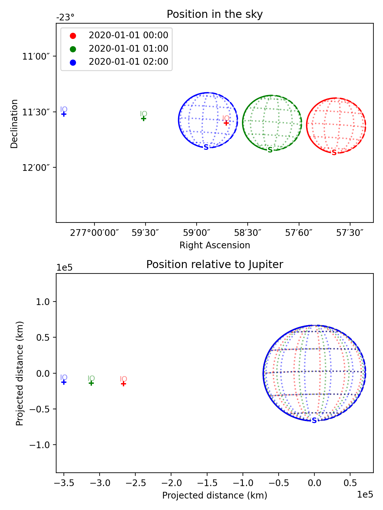

General Python API
******************
This page shows some simple examples of using the PlanetMapper in Python code. For more details, see the full :ref:`API documentation <api>`.

.. hint::
    The Python script used to generate the figures shown on this page can be found `here <https://github.com/ortk95/planetmapper/blob/main/planetmapper/examples/general_python_api.py>`_.

Wireframe plots
======================
'Wireframe' plots showing the geometry of target bodies can be created quickly and easily using the :func:`planetmapper.Body.plot_wireframe_radec` command: ::

    import planetmapper
    import matplotlib.pyplot as plt

    body = planetmapper.Body('saturn', '2020-01-01')
    body.plot_wireframe_radec()
    plt.show()

.. image:: images/saturn_wireframe_radec.png
    :width: 600
    :alt: Plot of Saturn

More complex plots can also be created using the functionality in :class:`planetmapper.Body` and manually adding elements to the plot: ::
    
    body = planetmapper.Body('neptune', '2020-01-01')

    # Add Triton to any wireframe plots
    body.add_other_bodies_of_interest('triton') 

    # Mark this specific coordinate (if visible) on any wireframe plots
    body.coordinates_of_interest_lonlat.append((360, -45)) 

    # Add some rings to the plot
    rings = planetmapper.data_loader.get_ring_radii()['NEPTUNE']
    for radii in rings.values():
        body.ring_radii.update(radii)

    fig, ax = plt.subplots(figsize=(6, 6), dpi=200)
    body.plot_wireframe_radec(ax)

    # Manually add some text to the plot
    ax.text(
        body.target_ra, body.target_dec + 2 / 60 / 60, 'NEPTUNE', color='b', ha='center'
    )

    plt.show()

.. image:: images/neptune_wireframe_radec.png
    :width: 600
    :alt: Plot of Neptune

A number of different wireframe plotting options are available:

- :func:`planetmapper.Body.plot_wireframe_radec` plots in RA/Dec coordinates
- :func:`planetmapper.Body.plot_wireframe_km` plots in a frame centred on the target body
- :func:`planetmapper.BodyXY.plot_wireframe_xy` plots in image x and y coordinates

`plot_wireframe_km` is particularly for comparing observations taken at different times, as it standardises the rotation and size of the target. The example below shows multiple observations of Jupiter and Io taken over the space of a few hours. Jupiter moves across the the RA/Dec plot (top), but stays fixed in the km plot (bottom), making it easier to see the relative motion of Io: ::

    fig, [ax_radec, ax_km] = plt.subplots(nrows=2, figsize=(6, 8), dpi=200)

    dates = ['2020-01-01 00:00', '2020-01-01 01:00', '2020-01-01 02:00']
    colors = ['r', 'g', 'b']

    for date, c in zip(dates, colors):
        body = planetmapper.Body('jupiter', date)
        body.add_other_bodies_of_interest('Io')
        body.plot_wireframe_radec(ax_radec, color=c)
        body.plot_wireframe_km(ax_km, color=c)

        # Plot some blank data with the correct colour to go on the legend
        ax_radec.scatter(float('nan'), float('nan'), color=c, label=date)

    ax_radec.legend(loc='upper left')

    ax_radec.set_title('plot_wireframe_radec(...)')
    ax_km.set_title('plot_wireframe_km(...)')

    fig.tight_layout()
    plt.show()

