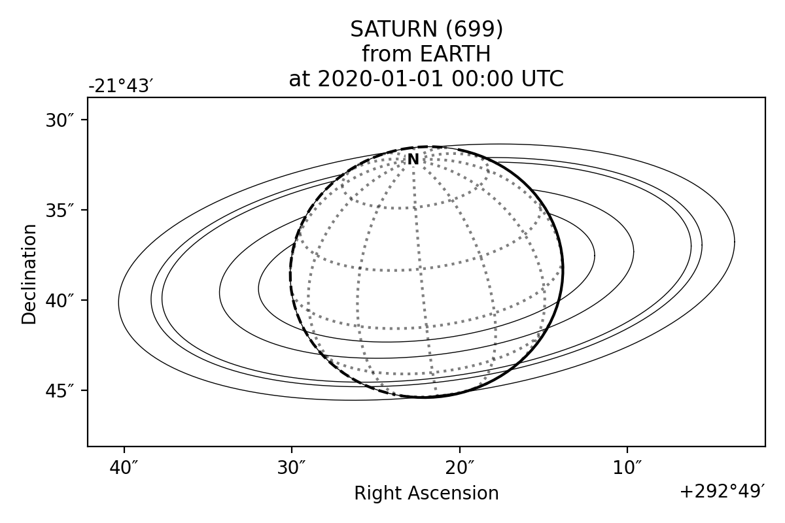
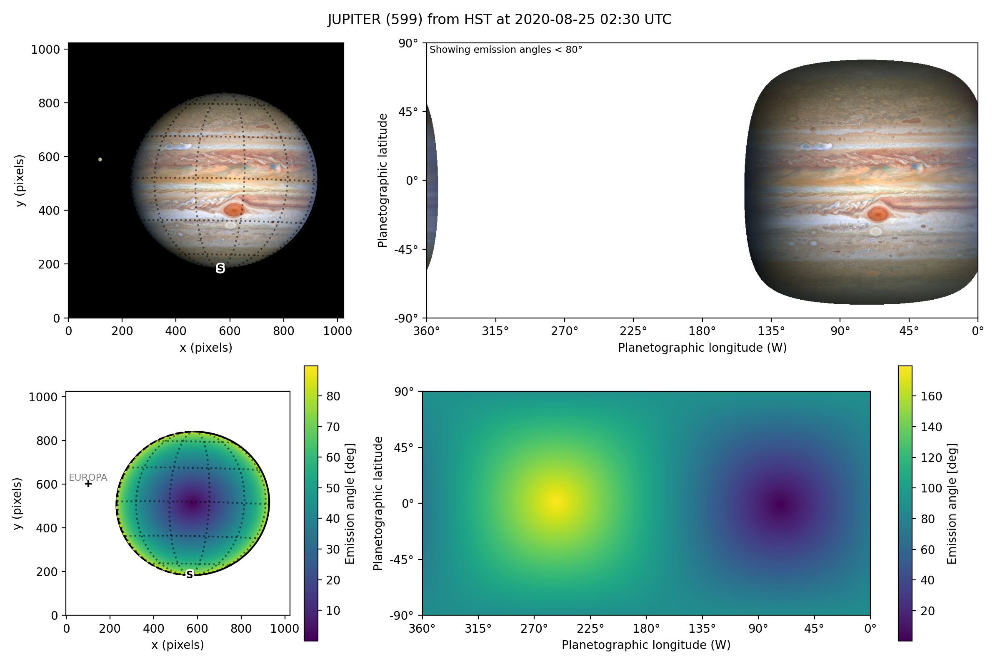

PlanetMapper
************

PlanetMapper is an open source Python module for visualising, navigating and mapping Solar System observations.

.. .. image:: images/logo_wide_transparent.png
..     :alt: PlanetMapper logo

Key features
============
:ref:`Fit and map astronomical observations using a full featured user interface <gui examples>`
------------------------------------------------------------------------------------------------
.. image:: images/gui_fitting.png
    :width: 600
    :alt: Screenshot of the fitting window after the disc is fit.

:ref:`Easily visualise solar system observations with just a few lines of code <wireframes>`
--------------------------------------------------------------------------------------------
::

   body = planetmapper.Body('saturn', '2020-01-01')
   body.plot_wireframe_radec()
   plt.show()

:ref:`Convert coordinates, generate backplanes and project maps of telescope observations <python examples>`
------------------------------------------------------------------------------------------------------------

:ref:`Citing PlanetMapper <citation>`
=====================================
If you use PlanetMapper in your research, please cite the following paper:

   King et al., (2023). PlanetMapper: A Python package for visualising, navigating and mapping Solar System observations. Journal of Open Source Software, 8(90), 5728, https://doi.org/10.21105/joss.05728

.. code-block:: bibtex

   @article{king_2023_planetmapper,
     author  = {King, Oliver R. T. and Fletcher, Leigh N.},
     doi     = {10.21105/joss.05728},
     journal = {Journal of Open Source Software},
     month   = oct,
     number  = {90},
     pages   = {5728},
     title   = {{PlanetMapper: A Python package for visualising, navigating and mapping Solar System observations}},
     url     = {https://joss.theoj.org/papers/10.21105/joss.05728},
     volume  = {8},
     year    = {2023}
   }

.. toctree::
   :maxdepth: 2
   :caption: Getting Started

   installation
   spice_kernels
   common_issues

.. toctree::
   :maxdepth: 2
   :caption: Examples
   
   user_interface
   general_python_api

.. toctree::
   :maxdepth: 2
   :caption: API Reference

   documentation
   base
   gui
   utils
   data_loader
   kernel_downloader

.. toctree::
   :maxdepth: 2
   :caption: Appendix

   default_backplanes
   credits
   citation
   license
   links
