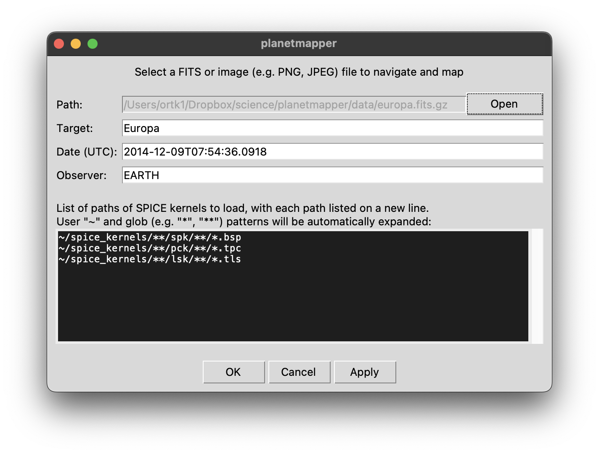
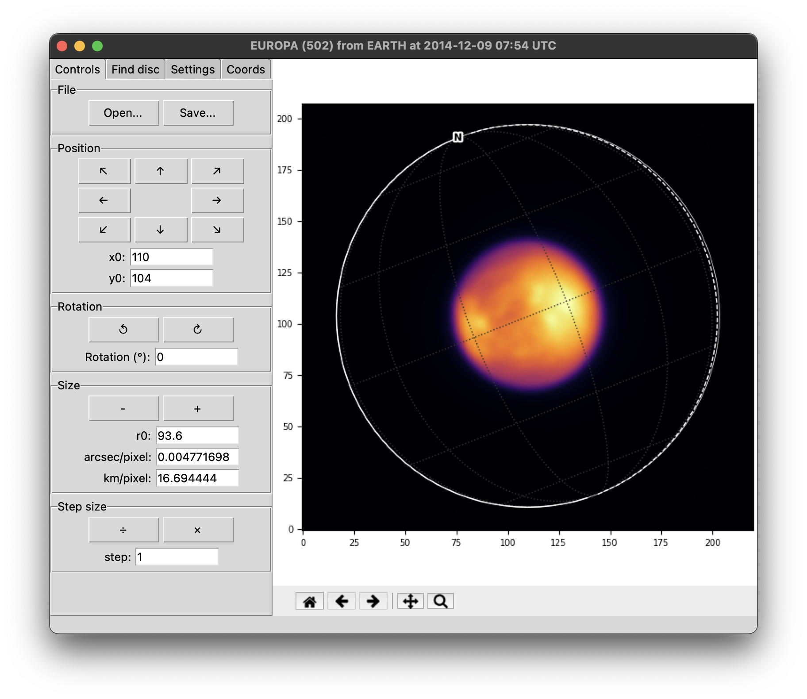
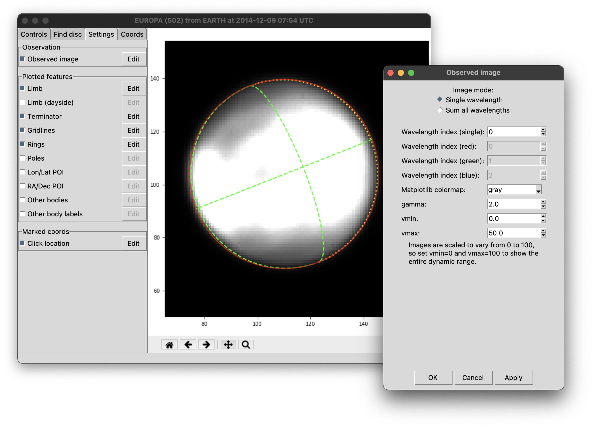
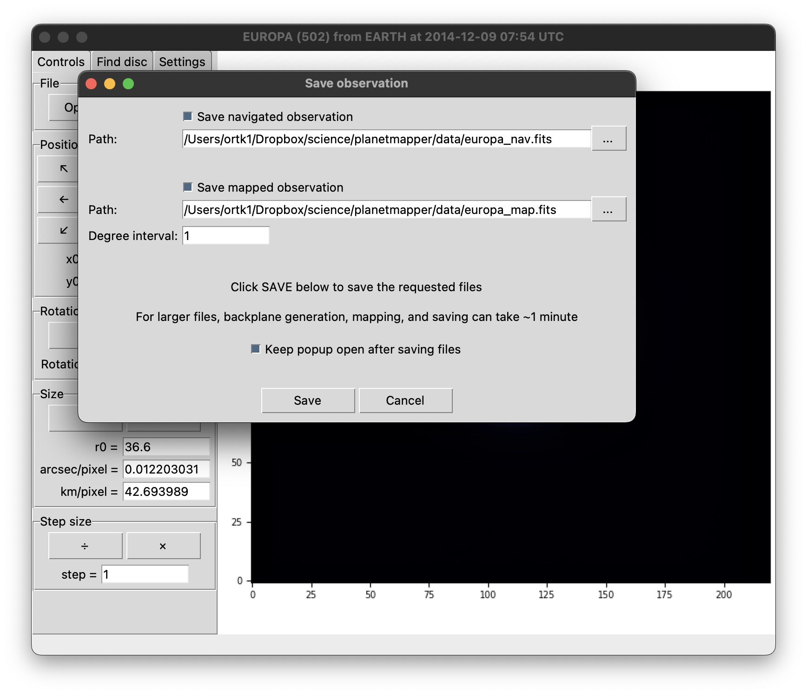
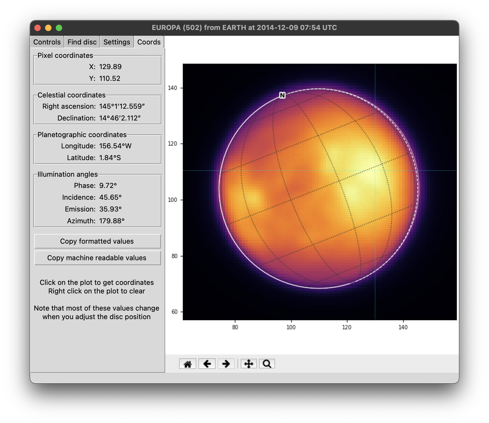

.. _gui examples:

Graphical user interface
************************

The Graphical User Interface (GUI) is a convenient and easy way to fit an observation, generate backplanes and map the observed data.

Starting the user interface
===========================
The easiest way to run the PlanetMapper user interface is to simply type `planetmapper` in the command line (or alternatively, call the :func:`planetmapper.run_gui` Python function). This will launch a new interactive window where you can choose observation files to open and fit.

You can also create a user interface from a :class:`planetmapper.Observation` object using the  :func:`planetmapper.Observation.run_gui` function. This is mainly useful if you want to combine using a user interface to fit the observation with some Python code to e.g. run some additional analysis. This also gives you access to the full customisation offered by :class:`planetmapper.Observation`, allowing you to specify parameters such as `illumination_source` and `aberration_correction` which cannot be customised using the GUI alone.

Fitting an observation
======================
.. note::
    You can download the Europa data file [#king2022]_ used in these examples from the `PlanetMapper GitHub repository <https://github.com/ortk95/planetmapper/tree/main/examples/gui_data>`_.

To start, launch the PlanetMapper user interface from either the command line, or from within Python:

- From an operating system command line: type `planetmapper` and press :kbd:`Enter`.
- From a Python terminal (or within a Python script): import `planetmapper`, then run :func:`planetmapper.run_gui`.

These will both open a window where you can then choose a file to open:
 

If your data is a FITS file, PlanetMapper will attempt to automatically fill the target, date and observer fields for you with information from the FITS header (but it's worth double checking that the values are what you expect). The date should be in a format which `can be understood by SPICE <https://naif.jpl.nasa.gov/pub/naif/toolkit_docs/C/cspice/utc2et_c.html#Examples>`_ (such as `YYYY-mm-ddTHH:MM:SS`) and should be in UTC. You can also specify a list of :ref:`SPICE kernels` to load here - if you're unsure then the default values will probably work.

.. hint::
    The target, date and observer fields are passed directly to the `target`, `utc` and `observer` parameters of a :class:`planetmapper.Observation` object, so check the full documentation for :class:`planetmapper.Observation` and :class:`planetmapper.Body` for details of what formats are accepted.

Once you click :guilabel:`OK`, the full fitting window should open. If you get any error messages, then double check the target, date and observer fields for any typos.

This window allows you to fit the observation, so that the fitted disc (the white circle) overlaps nicely with the observed disc. You can use the buttons on the left hand side to move the disc around, or input specific values in the text boxes (for example, you may know the plate scale in arcsec/pixel of the telescope you are using). You can also find the keyboard shortcut for each button by hovering over it and reading the hint at the bottom of the window.

.. image:: images/gui_fitting.png
    :width: 600
    :alt: Screenshot of the fitting window after the disc is fit.

Once the disc is fit, it should look something like the image above. If you want more fine control from clicking the buttons, then you can adjust the step size. It can often be useful to start with a large step size, then decrease it for the final fine alignment.

You can fully customise the appearance of the plot on the right to make fitting easier (or if you just fancy a more exciting colour scheme). In the :guilabel:`Settings` tab, you can toggle the visibility of different plotted elements, and you can click on :guilabel:`Edit` to customise them further. It can be particularly useful to customise the colour scale and brightness of the observed image to increase the contrast around the limb. The zoom and pan buttons beneath the plot can be used to move around the image - click the home button to reset to the default view

You can also use the :guilabel:`Settings` tab to mark points of interest to help with fitting. For example:

- You can mark a specific location (e.g. a distinctive impact crater) on the surface of the target with a :guilabel:`Lon/Lat POI`.
- You can mark a specific sky coordinate (e.g. a background star) with a :guilabel:`RA/Dec POI`.
- You can mark the location of :guilabel:`Other bodies` (e.g. if you are fitting an observation of Jupiter, you may want to mark the positions of any of its moons which are also in shot). 

Once you are happy with the fitting result, click :guilabel:`Save` at the top of the :guilabel:`Controls` tab. This will open a window where you can choose which files to output. You can customise which files to output (with the :guilabel:`Save navigated observation` and :guilabel:`Save mapped observation` checkboxes) and choose the filepath where these files will be saved.

- The navigated observation is similar to the input file, with additional 'FITS backplanes' containing useful information such as the longitude/latitude coordinates for each pixel in the image. This file is generated using the function :func:`planetmapper.Observation.save_observation`.
- The mapped observation produces a FITS file which contains (as the name suggests...) a mapped version of the observation. This map file will also contain the various useful backplanes. The map projection and resolution of the output data can be fully customised. This file is generated using the function :func:`planetmapper.Observation.save_mapped_observation`.

Once you click :guilabel:`Save`, your requested files will be generated and saved. Note that for larger files, this can take around a minute to complete as some of the coordinate conversion calculations are relatively complex.

You can also use the user interface to directly measure the coordinates of points of interest. Simply click on a location in the plot and the coordinate values for that location will be displayed in the :guilabel:`Coords` tab. The coordinate values will also be printed to the command line in a machine readable format that can easily be copied directly into a Python script, JSON database etc. If clicking on the plot isn't updating the coordinates for you, make sure you don't have the pan or zoom buttons selected.
    

Running the UI from Python
===================================
This simple example shows how you could use :func:`planetmapper.Observation.run_gui` from a Python script to fit multiple observations, then run some custom code on each of them: ::

    import glob
    import planetmapper

    for path in sorted(glob.glob('data/*.fits')):
        # Running from Python allows you to customise SPICE settings like the aberration correction
        observation = planetmapper.Observation(path, aberration_correction='CN+S')

        # Run some custom setup
        observation.add_other_bodies_of_interest('Io', 'Europa', 'Ganymede', 'Callisto')
        observation.set_plate_scale_arcsec(42) # set a custom plate scale
        observation.rotation_from_wcs() # get the disc rotation from the header's WCS info

        # Run the GUI to fit the observation interactively 
        # This will open a GUI window every loop
        coords = observation.run_gui()

        # More custom code can go here to use the fitted observation...
        # for example, we can print some values for the last click location 
        if coords:
            x, y = coords[-1]
            print(observation.xy2lonlat(x, y))

.. [#king2022] The example Europa dataset is from King et al. (2022). *Compositional Mapping of Europa using MCMC Modelling of Near-IR VLT/SPHERE and Galileo/NIMS Observations.* DOI: `10.3847/PSJ/ac596d <https://doi.org/10.3847/PSJ/ac596d>`_.